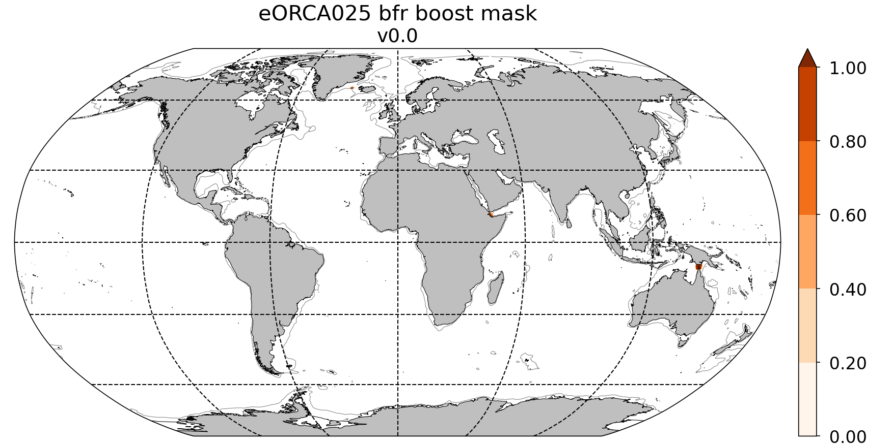

********************
eORCA025 input files
********************

Coordinates
===========

.. _eORCA025_coord_c3.0:

eORCA025_coord_c3.0.nc
----------------------

Source:
   - file build at Mercator (Clement Bricaud):
Comments:
   - Bug in the north corrected.
   - add proper extension under masked area
Original name:
   - eORCA_R025_coordinates_v3.0.nc
Reference for the south extension:
   - Mathiot, P., Jenkins, A., Harris, C., and Madec, G.: Explicit representation and parametrised impacts of under ice shelf seas in the z∗ coordinate ocean model NEMO 3.6, Geosci. Model Dev., 10, 2849–2874, https://doi.org/10.5194/gmd-10-2849-2017, 2017.
Path:
   - file: https://ige-meom-opendap.univ-grenoble-alpes.fr/thredds/catalog/meomopendap/extract/eORCA025.L121/eORCA025.L121-I/catalog.html?dataset=meomscanpublic/eORCA025.L121/eORCA025.L121-I/eORCA025_coord_c3.0.nc

Bathymetry and ice shelf draft
==============================

.. _eORCA025_bathymetry_b0.0:

eORCA025_bathymetry_b0.0.nc
---------------------------
Original name:
   - bathy_noisf_ORCA025_IBCSO_ETOPO1_mask75L_v2.2_landsuppression.nc
Source:
   - File used in GO6 (cite GO6 paper)
References:
   - Storkey, D., Blaker, A. T., Mathiot, P., Megann, A., Aksenov, Y., Blockley, E. W., Calvert, D., Graham, T., Hewitt, H. T., Hyder, P., Kuhlbrodt, T., Rae, J. G. L., and Sinha, B.: UK Global Ocean GO6 and GO7: a traceable hierarchy of model resolutions, Geosci. Model Dev., 11, 3187–3213, https://doi.org/10.5194/gmd-11-3187-2018, 2018.
   - Mathiot, P., Jenkins, A., Harris, C., and Madec, G.: Explicit representation and parametrised im    pacts of under ice shelf seas in the z∗ coordinate ocean model NEMO 3.6, Geosci. Model Dev., 10,     2849–2874, https://doi.org/10.5194/gmd-10-2849-2017, 2017.
Comments:
   - Method for the southern extention described in Mathiot et al., 2017

.. _eORCA025_bathymetry_b0.1:

eORCA025_bathymetry_b0.1.nc
---------------------------
Original name:
   - eORCA025_bathymetry_isf_v2.3.nc
Source :
   - File used in GO7 (cite GO6 paper)
References:
   - Storkey, D., Blaker, A. T., Mathiot, P., Megann, A., Aksenov, Y., Blockley, E. W., Calvert, D., Graham, T., Hewitt, H. T., Hyder, P., Kuhlbrodt, T., Rae, J. G. L., and Sinha, B.: UK Global Ocean GO6 and GO7: a traceable hierarchy of model resolutions, Geosci. Model Dev., 11, 3187–3213, https://doi.org/10.5194/gmd-11-3187-2018, 2018.
   - Mathiot, P., Jenkins, A., Harris, C., and Madec, G.: Explicit representation and parametrised im    pacts of under ice shelf seas in the z∗ coordinate ocean model NEMO 3.6, Geosci. Model Dev., 10,     2849–2874, https://doi.org/10.5194/gmd-10-2849-2017, 2017.
Comments:
   - as b0.0 but with under ice shelf data (isf draft and bathy) from bedmap2.
   - Method for the southern extention described in Mathiot et al., 2017

.. _eORCA025_bathymetry_b0.2:

eORCA025_bathymetry_b0.2.nc
---------------------------
Heritage:
   - :ref:`eORCA025_bathymetry_b0.1`
Source:
   - Bathymetry north of Antarctic continental slope: :ref:`eORCA025_bathymetry_b0.1`
   - Bathymetry south of Antarctic continental slope: Bed Machine (BedMachineAntarctica-2020-07-15.nc). Version available on the server is bugged (issue with reference for the IBCSO part).
   - ice shelf draft is from BedMachineAntarctica-2020-07-15.nc
   - path to raw data: TOADD
Reference:
   - Morlighem, M., E. Rignot, T. Binder, D. D. Blankenship, R. Drews, G. Eagles, O. Eisen, F. Ferraccioli, R. Forsberg, P. Fretwell, V. Goel, J. S. Greenbaum, H. Gudmundsson, J. Guo, V. Helm, C. Hofstede, I. Howat, A. Humbert, W. Jokat, N. B. Karlsson, W. Lee, K. Matsuoka, R. Millan, J. Mouginot, J. Paden, F. Pattyn, J. L. Roberts, S. Rosier, A. Ruppel, H. Seroussi, E. C. Smith, D. Steinhage, B. Sun, M. R. van den Broeke, T. van Ommen, M. van Wessem, and D. A. Young. 2020. Deep glacial troughs and stabilizing ridges unveiled beneath the margins of the Antarctic ice sheet, Nature Geoscience. 13. 132-137. https://doi.org/10.1038/s41561-019-0510-8
Method:
   - step 1: create the lat/lon variable associated to the netcdf file (BedMachine2NEMOBAT.py)
   - step 2: run interpolation for bathymetry, isfdraft, mask
   - step 3: smooth as eORCA025 bathymetry
   - step 4: enforce compatibility and build mask before combining data set
   - step 5: combine with reference eORCA025 bathymetry (b0.0) files
Tools:
   - NEMOBAT: https://github.com/pmathiot/NEMOBAT (ce3db4f..78d1867)
Path:
  - file: https://ige-meom-opendap.univ-grenoble-alpes.fr/thredds/catalog/meomopendap/extract/eORCA025.L121/eORCA025.L121-I/catalog.html?dataset=meomscanpublic/eORCA025.L121/eORCA025.L121-I/eORCA025_bathymetry_b0.2.nc

.. _fig_eORCA025_geometry:

   Top: Bathymetry (a) and ice shelf draft (b) in :ref:`eORCA025_bathymetry_b0.2`. Bot: differences between b0.2 and b0.1 bathymetry (a) and isf draft (b).

.. _eORCA025_bathymetry_b0.3:

eORCA025_bathymetry_b0.3.nc
---------------------------
Heritage:
  - :ref:`eORCA025_bathymetry_b0.2`
Change:
  - add iceberg tongue in Amundsen sea and adjust Getz ice shelf draft to match NEMO termocline.

Reference:
  - Bett paper
Method:
  - step 1: create the lat/lon variable associated to the netcdf file (BedMachine2NEMOBAT.py)
  - step 2: run interpolation for bathymetry, isfdraft, mask
  - step 3: smooth as eORCA025 bathymetry
  - step 4: enforce compatibility and build mask before combining data set
  - step 5: combine with reference eORCA025 bathymetry (b0.0) files
Tools:
  - BMGTOOLS: link to add
Path:
 - file:

.. _fig_eORCA025b03_geometry:

  Top: Bathymetry in eORCA025_bathymetry_b0.3 and eORCA025_bathymetry_b0.2 (top)
  and ice shelf draft differences between eORCA025_bathymetry_b0.3 and eORCA025_bathymetry_b0.2 (bottom).

  eORCA025_bathymetry_b0.5.nc
  ---------------------------
  Heritage:
    - :ref:`eORCA025_bathymetry_b0.3`
  Change:
    - Changes are focused on tip of Antarctica Peninsula
    (mostly Hesperide Trough and its sills depth).
    This leads to improvement in the circulation locally and West of the Ant. Peninsula.

  Reference:
    - Close up in Bedmachine data
  Method:
    - Hand edit using BMGtools
  Tools:
    - BMGTOOLS: link to add
  Path:
   - file:

  .. _fig_eORCA025b03_geometry:
  .. figure:: _static/eORCA025_bathy_change_b0.5.png
    :scale: 60

    Top: Bathymetry in Bedmachine (a), eORCA025_bathymetry_b0.3 (b)
    and eORCA025_bathymetry_b0.5 (c).

Domaincfg
=========

.. _eORCA025.L121_domain_cfg_b0.2_c3.0_d1.0:

eORCA025.L121_domain_cfg_b0.2_c3.0_d1.0.nc
------------------------------------------

Source:
   - bathymetry: :ref:`eORCA025_bathymetry_b0.2`
   - horiz. coordinates: :ref:`eORCA025_coord_c3.0`
   - vert. coordinates: z + 121 levels selected to have rougly constant resolution between 100m and 1000m (ie range of depth spanning by the isf cavities.

.. figure:: _static/L121_zgrid.png

   Vertical levels discretization (depth in x-axis and e3 in y-axis).
   Lines are the reference 75L in black, the first 121L guess in purple and the final discretisation in red dots.

   - The key namelist parameters are:

.. code-block:: console

    ppsur  = -9010.587848403375
    ppa0   =   106.31862889828116
    ppa1   =     7.952358497085131
    ppa2   =    97.73124662753601

    ppkth  =    22.180677730800767
    ppacr  =    11.02538019814476

    ppkth2 =   100.00000000000
    ppacr2 =    13.00000000000

    ppdzmin     =  999999.0             !  Minimum vertical spacing
    pphmax      =  999999.0             !  Maximum depth
    ldbletanh   =    .TRUE.             !  Use/do not use double tanf function for vertical coordinates

Comments:
   - full namelist available in the namelist_cfg variable in the netcdf file and tools to extract it is available in
     the DOMAIN_cfg tools (`DOMAINcfg <https://forge.ipsl.jussieu.fr/nemo/chrome/site/doc/NEMO/guide/html/tools.html#domaincfg>`_)
   - closed seas removed
Tools:
   - r13390 of NEMO DOMAIN_cfg tools
Paths:
   - building directory: TOADD
   - file: https://ige-meom-opendap.univ-grenoble-alpes.fr/thredds/catalog/meomopendap/extract/eORCA025.L121/eORCA025.L121-I/catalog.html?dataset=meomscanpublic/eORCA025.L121/eORCA025.L121-I/eORCA025.L121_domain_cfg_b0.2_c3.0_d1.0.nc

.. _eORCA025.L121_domain_cfg_b0.3_c3.0_d1.0:

eORCA025.L121_domain_cfg_b0.3_c3.0_d1.0.nc
------------------------------------------
Heritage:
  - :ref:`eORCA025.L121_domain_cfg_b0.2_c3.0_d1.0`

Change:
  - source file is :ref:`eORCA025_bathymetry_b0.3` instead of :ref:`eORCA025_bathymetry_b0.2`.

Paths:
  - Building directory: https://ige-meom-opendap.univ-grenoble-alpes.fr/thredds/catalog/meomopendap/extract/eORCA025.L121/eORCA025.L121-BLD/DOMAINcfg/eORCA025/eORCA025.L121_domain_cfg_b0.3_c3.0_d1.0/catalog.html
  - File: https://ige-meom-opendap.univ-grenoble-alpes.fr/thredds/fileServer/meomopendap/extract/eORCA025.L121/eORCA025.L121-BLD/DOMAINcfg/eORCA025/eORCA025.L121_domain_cfg_b0.3_c3.0_d1.0/eORCA025.L121_domain_cfg_b0.3_c3.0_d1.0.nc

eORCA025.L121_domain_cfg_b0.5_c3.0_d1.0.nc
------------------------------------------
Heritage:
- :ref:`eORCA025.L121_domain_cfg_b0.3_c3.0_d1.0`

Change:
- source file is :ref:`eORCA025_bathymetry_b0.5` instead of :ref:`eORCA025_bathymetry_b0.3`.

Paths:
- Building directory:
- File:

Runoff
======

First_runoff_file:
------------------

Source:
   - The runoffs data file comes from the Dai and Trenberth study . It is documented in a publication (Dai and Trenberth, 2002, hereafter DT02). The spatial resolution of this file is 1◦ ×1◦ with monthly data. This data are available on the web : http ://www.cgd.ucar.edu/cas/catalog/dai/
Reference:
   - https://www.drakkar-ocean.eu/publications/reports/runoff-mercator-06.pdf

.. _eORCA025_runoff_b0.2_v0.0:

eORCA025_runoff_b0.2_v0.0.nc
----------------------------
Sources:
   - The runoffs data file comes from the Dai and Trenberth study . It is documented in a publication (Dai and Trenberth, 2002, hereafter DT02). The spatial resolution of this file is 1◦ ×1◦ with monthly data. This data are available on the web : http ://www.cgd.ucar.edu/cas/catalog/dai/
Original name:
   - ORCA025_rnficbisf_rignot2013_noberg.nc
Compatibility:
   - bathymetry: :ref:`eORCA025_bathymetry_b0.2` and :ref:`eORCA025_bathymetry_b0.3` as coastline (where rnf are) does not change.
Comments:
   - original file from the Met Office. As the coastline north of Antactica did not change, the GO6 runoff is adapted to the bathymetry 0.3.
   - Antarctic runoff has been removed in Mathiot et al. (2017).
   - GO6 runoff variable name is confusing. This is: sornficb (even if no icb are present in it.
   - we rename runoff variable name to sorunoff.
   - we extract only the variable related to runoff (sorunoff,socoefr,nav_lat,nav_lon)
Paths:
   - file: https://ige-meom-opendap.univ-grenoble-alpes.fr/thredds/catalog/meomopendap/extract/eORCA025.L121/eORCA025.L121-I/catalog.html?dataset=meomscanpublic/eORCA025.L121/eORCA025.L121-I/eORCA025_runoff_b0.2_v0.0.nc

TS Climatology
==============

.. _eORCA025.L121_WOA2018_b0.2_c3.0_d1.0_v19812010.4:

eORCA025.L121_WOA2018_b0.2_c3.0_d1.0_v19812010.4.nc
---------------------------------------------------
Source:
   - Open ocean: WOA2018 on period 1981-2010 (see :ref:WOA2018_v19812010.1 for details)
   - Under isf: UKMO eORCA025 JRA simulation bt705 over period (1995-2005)
Methode:
   - WOA are drowned and interpolated to :ref:`eORCA025.L121_domain_cfg_b0.2_c3.0_d1.0.nc`
   - WOA is only provided for each season, so we build the monthly 3D file with a linear interpolation
   - WOA is only provided monthly data between surface and 1450m depth, we used this data for first 1400m
     (ie level 89, last level fully included in the monthly data).
   - A linear transition from one to the other data set is done between 1200m and depth of level 90.
   - UKMO data are downloaded monthly and a climatology is built
   - Merge between the 2 data set is done in the open ocean. UKMO data are kept until 10km offshore the Antarctic ice shelves. WOA is kept for cell further away than 70 km offshore the Antarctic ice shelves. A linear transition in the transition area is applied.
   - A non penetrative convection scheme is applied to avoid static instability
   - A shapiro filter is applied to remove strong gradient (3 passes)
Compatibility:
   - eORCA025.L121_domain_cfg_b0.2_c3.0_d1.0.nc as file is masked.
Path:
   - directory: TOADD
   - file: TOADD
Comments:
    - 11/02/2021: do not use this file for temperature was assumed to be potential and in fact it is in-situ. So need to be rebuilt.

.. _eORCA025.L121_WOA2018_b0.2_c3.0_d1.0_v19812010.5:

eORCA025.L121_WOA2018_b0.2_c3.0_d1.0_v19812010.5.nc
---------------------------------------------------
Source:
   - Open ocean: WOA2018 on period 1981-2010 (see :ref:`WOA2018_v19812010.1` for details)
   - Under isf: UKMO eORCA025 JRA simulation bt705 over period (1995-2005)
Methode:
   - as :ref:`eORCA025.L121_WOA2018_b0.2_c3.0_d1.0_v19812010.4`
   - convert to TEOS10 using GSW-Fortran-3.05-6 package (see TEOS10 directory in building directory)
   - then check and correct overlap cells with check_lbclnk_v3.py
Compatibility:
   - eORCA025.L121_domain_cfg_b0.2_c3.0_d1.0.nc as file is masked.
Path:
   - directory: TOADD
   - file: https://ige-meom-opendap.univ-grenoble-alpes.fr/thredds/catalog/meomopendap/extract/eORCA025.L121/eORCA025.L121-I/catalog.html?dataset=meomscanpublic/eORCA025.L121/eORCA025.L121-I/eORCA025.L121_WOA2018_b0.2_c3.0_d1.0_v19812010.5.nc
Comments:
   - 11/02/2021: do not use this file for temperature was assumed to be potential and in fact it is in-situ. So need to be rebuilt.

.. _eORCA025.L121_WOA2018_c3.0_d1.0_v19812010.5.1:

eORCA025.L121_WOA2018_c3.0_d1.0_v19812010.5.1.nc
------------------------------------------------

Source:
   - Open ocean: WOA2018 over period 1980-2010 at 1 degree resolution converted to TEOS10
   - Under isf: UKMO eORCA025 JRA simulation bt705 over period (1995-2005) converted to TEOS10

Methode:
    - merge and mask data set:

        + WOA2018 in open Ocean offshore (70+ km away from the coast)
        + bt705 under the ice shelves and up to 10 km away for the ice shelves
        + transition

    .. code-block:: console

        python combine_WOA2018_bt705.py

    - smoothing of the data

    .. code-block:: console

        cdfsmooth -f eORCA025.L121_WOA2018_b0.2_c3.0_d1.0_v19812010_tmp.nc -c 3 -t S -anis 1 -nc4

    - check for static instability and mix if needed

    .. code-block:: console

        cdfcheckic -t eORCA025.L121_WOA2018_b0.2_c3.0_d1.0_v19812010_tmp.ncS003 -o eORCA025.L121_WOA2018_b0.2_c3.0_d1.0_v19812010_checkic.ncS003 -nc4

    - drown files

    .. code-block:: console

        ./mask_drown_field.x -D -i eORCA025.L121_WOA2018_b0.2_c3.0_d1.0_v19812010_checkic.ncS003 -v votemper -x nav_lon -y nav_lat -z deptht -t time_counter -p 1 -g 200 -o votemper_eORCA025.L121_WOA2018_b0.2_c3.0_d1.0_v19812010_checkic.ncS003_drown -m mask.nc -q tmask

        ./mask_drown_field.x -D -i eORCA025.L121_WOA2018_b0.2_c3.0_d1.0_v19812010_checkic.ncS003 -v vosaline -x nav_lon -y nav_lat -z deptht -t time_counter -p 1 -g 200 -o vosaline_eORCA025.L121_WOA2018_b0.2_c3.0_d1.0_v19812010_checkic.ncS003_drown -m mask.nc -q tmask

    - check boundary conditions

    .. code-block:: console

        python ./check_lbclnk_v3.py -v vosaline votemper -p T -f eORCA025.L121_WOA2018_b0.2_c3.0_d1.0_v19812010_checkic.ncS003_drown

Compatibility:
    - eORCA025.L121_domain_cfg_b?.?_c3.0_d1.0.nc as file is drowned

path:
    - https://ige-meom-opendap.univ-grenoble-alpes.fr/thredds/catalog/meomopendap/extract/eORCA025.L121/eORCA025.L121-I/catalog.html?dataset=meomscanpublic/eORCA025.L121/eORCA025.L121-I/eORCA025.L121_WOA2018_c3.0_d1.0_v19812010.5.1.nc

.. _eORCA025.L121_WOA2018_c3.0_d1.0_v19812010.5.2:

eORCA025.L121_WOA2018_c3.0_d1.0_v19812010.5.2.nc
------------------------------------------------

Source:
    - Open ocean: WOA2018 over period 1980-2010 at 1 degree resolution converted to TEOS10
Methode:
    - gather monthly top 1550m with deep seasonal data (linear interpolation for seasonal data and linear transition between 1200m and 1550m)
    - convert to TEOS10
    - drown in taking care of where the water comes from (branch drown_with_constrain)

Compatibility:
    - eORCA025.L121_domain_cfg_b?.?_c3.0_d1.0.nc as file is drowned

Path:
    - https://ige-meom-opendap.univ-grenoble-alpes.fr/thredds/catalog/meomopendap/extract/eORCA025.L121/eORCA025.L121-BLD/TS/eORCA025.L121_WOA2018_c3.0_d1.0_v19812010.5.2/catalog.html

File:
    - https://ige-meom-opendap.univ-grenoble-alpes.fr/thredds/catalog/meomopendap/extract/eORCA025.L121/eORCA025.L121-BLD/TS/eORCA025.L121_WOA2018_c3.0_d1.0_v19812010.5.2/catalog.html?dataset=meomscanpublic/eORCA025.L121/eORCA025.L121-BLD/TS/eORCA025.L121_WOA2018_c3.0_d1.0_v19812010.5.2/eORCA025.L121_WOA2018_c3.0_d1.0_v19812010.5.2.nc

.. _eORCA025.L121_Gouretski2004_c3.0_d1.0_v0.0:

eORCA025.L121_Gouretski2004_c3.0_d1.0_v0.0.nc
---------------------------------------------

Source:
    - Gouretski, V., and K. Koltermann, 2004: WOCE global hydro- graphic climatology, a technical report. Berichte des BSH Tech. Rep. 35, 52 pp.
    - https://icdc.cen.uni-hamburg.de/thredds/catalog/ftpthredds/woce/catalog.html?dataset=ftpthreddsscan/woce/wghc_params.nc

Method:
    All the details are in the README into the building directory.
    In summary, here are the step.

    - interpolate with sosie3 onto the output grid (NEMO grid)
    - drown file (mask_drown_field.x) needed are input file grid do not extend to -90, so data are missing in the very far south (under Ross ice shelf and FRIS)
    - convert to teos10

Compatibility:
    - eORCA025.L121_dmpmask_b0.2_c3.0_d1.0_v0.0.nc
    - eORCA025.L121_domain_cfg_b??_c3.0_d1.0.nc file is drowned

Comments:
    - this is an annual climatology

Path:
    -

Ice Initial condition
=====================

.. _eORCA025_seaice_c3.0_v19802004.0:

eORCA025_seaice_c3.0_v19802004.0.nc
-----------------------------------
Source:
   - Data comes from bt705 JRA run from the UKMO
Variables:
   - ice concentration (siconc)
   - ice thickness (sithic)
   - snow thickness (snvolu)
Method :
   - climatology is done for each month over period 1980 to 2004 (siconc, sithic, snvolu)
   - snthic computed using snthic=snvolu/siconc for point where siconc > 0 each month
     then average over the whole period.
Path:
    - directory: TOADD
    - file: https://ige-meom-opendap.univ-grenoble-alpes.fr/thredds/catalog/meomopendap/extract/eORCA025.L121/eORCA025.L121-I/catalog.html?dataset=meomscanpublic/eORCA025.L121/eORCA025.L121-I/eORCA025_seaice_c3.0_v19802004.0.nc

Restoring
=========

sss_WOA2018r04_v19812010.2.nc
-----------------------------
Source:
    - WOA2018 on period 1981-2010 (see :ref:WOA2018_v19812010.1 for details)
Methode:
    - monthly WOA surface data are drowned.
    - original file is compressed to level 1 and we used a smaller chunk size.
Variable:
    - s_an in PSU
Frequency:
    - monthly
Weights:
    - eORCA025_sss_WOA2018r04_v19812010_c3.0_weights_bilin.nc
      (compatible with :ref:`eORCA025_coord_c3.0` or :ref:`eORCA025.L121_domain_cfg_b0.2_c3.0_d1.0`)

eORCA025_sss_WOA2018r04_v19812010.5.nc
--------------------------------------
Source:
   - WOA2018 on period 1981-2010 (see :ref:`eORCA025.L121_WOA2018_b0.2_c3.0_d1.0_v19812010.5` for details)
Methode:
   - extract surface value of :ref:`eORCA025.L121_WOA2018_b0.2_c3.0_d1.0_v19812010.5` file
Variable:
   - s_an in absolute salinity
Frequency:
   - monthly
Path:
   - file: https://ige-meom-opendap.univ-grenoble-alpes.fr/thredds/catalog/meomopendap/extract/eORCA025.L121/eORCA025.L121-I/catalog.html?dataset=meomscanpublic/eORCA025.L121/eORCA025.L121-I/eORCA025_sss_WOA2018_c3.0_v19812010.5.nc

eORCA025_sss_WOA2018_c3.0_v19812010.5.1.nc
------------------------------------------
Source:
    - WOA2018 on period 1981-2010 (see :ref:`eORCA025.L121_WOA2018_c3.0_d1.0_v19812010.5.1` for details)
Methode:
    - extract surface value of :ref:`eORCA025.L121_WOA2018_c3.0_d1.0_v19812010.5.1` file

    .. code-block:: console

        ncks -x -v votemper -d z,0,0 eORCA025.L121_WOA2018_c3.0_d1.0_v19812010.5.1.nc -o eORCA025_sss_WOA2018_c3.0_v19812010.5.1_tmp.nc
        ncwa -a z eORCA025_sss_WOA2018_c3.0_v19812010.5.1_tmp.nc eORCA025_sss_WOA2018_c3.0_v19812010.5.1.nc
        ncrename -v vosaline,sosaline eORCA025_sss_WOA2018_c3.0_v19812010.5.1.nc

Variable:
   - s_an in absolute salinity
Frequency:
   - monthly
Path:
    - https://ige-meom-opendap.univ-grenoble-alpes.fr/thredds/catalog/meomopendap/extract/eORCA025.L121/eORCA025.L121-I/catalog.html?dataset=meomscanpublic/eORCA025.L121/eORCA025.L121-I/eORCA025_sss_WOA2018_c3.0_v19812010.5.1.nc

eORCA025.L121-OPM021_y1999.1m.20y_flxT
--------------------------------------
data:
    - intensity of the sss restoring term from previous simulation. Use as a correction (it replace the traditional sss restoring term).
    Very handy for exact sensitivity experiments.
source:
    - eORCA025.L121-OPM021 simulation on period 1999-2018 (monthly climatology)
Methode:
    - ncrcat of the montly climatology output.

Iceberg calving
===============

.. _eORCA025_calving_b0.2_v2.3:

eORCA025_calving_b0.2_v2.3.nc
-----------------------------
the amount of calving per ice shelves comes from Rignot et al. (2013). The distribution along the ice shelf front is random (the idea is as I don't know where are the calving site and the amount of calving per site, I draw a random distribution of calving scale to the total amount provided by the climatology).

Sources:
   - north: as in March et al. (2015).
   - south: Rignot et al. (2013).
Useful tools:
   - git project: https://github.com/pmathiot/CDFTOOLS_4.0_ISF
   - tag: v3.0.2-330-g40595ba
   - path on dahu: /home/mathiotp/TOOLS/CDFTOOLS/20200823_40595ba/src
   - script: cdfisf_fill, cdficb_clv
Compatibility:
   - bathymetry: :ref:`eORCA025_bathymetry_b0.2` and :ref:`eORCA025_bathymetry_b0.3` as isf front along Antarctic are not changed.
Comments:
   - in this version only 1 time frame is provided, we can easily extend the logic to interannual calving or monthly calving by drawing X different state.
Variable:
   - soicbclv
Frequency:
   - annual
Path:
   - directory: https://ige-meom-opendap.univ-grenoble-alpes.fr/thredds/catalog/meomopendap/extract/eORCA025.L121/eORCA025.L121-BLD/ICB/eORCA025_calving_b0.2_v2.3/catalog.html
   - file: https://ige-meom-opendap.univ-grenoble-alpes.fr/thredds/catalog/meomopendap/extract/eORCA025.L121/eORCA025.L121-I/catalog.html?dataset=meomscanpublic/eORCA025.L121/eORCA025.L121-I/eORCA025_calving_b0.2_v2.3.nc

Geothermal heating
==================

.. _ghflux_v2.0:

ghflux_v2.0.nc
--------------
Goutorbe geothermal heat flux with online interpolation

Old name:
   - Goutorbe_ghflux.nc
Weights availables:
   - eORCA025_ghflux_v2.0_c3.0_weights_bilin.nc: weight compatible with :ref:`eORCA025_coord_c3.0` or :ref:`eORCA025.L121_domain_cfg_b0.2_c3.0_d1.0`
Path:
   - data file: https://ige-meom-opendap.univ-grenoble-alpes.fr/thredds/catalog/meomopendap/extract/eORCA025.L121/eORCA025.L121-I/catalog.html?dataset=meomscanpublic/eORCA025.L121/eORCA025.L121-I/ghflux_v2.0.nc
   - weight file: https://ige-meom-opendap.univ-grenoble-alpes.fr/thredds/catalog/meomopendap/extract/eORCA025.L121/eORCA025.L121-I/catalog.html?dataset=meomscanpublic/eORCA025.L121/eORCA025.L121-I/eORCA025_ghflux_v2.0_c3.0_weights_bilin.nc

.. _fig_geothermal:

Top tidal velocity
==================

As shown in Jourdain et al. (2018): including tidal velocities into the equation of the turbulent heat flux is a good approach to account for tide-induced melting in ocean models that do not explicitly represent tides. It is nonetheless important to keep the horizontal patterns of tidal velocities, and prescribing uniform tidal velocities leads to large errors.

.. _eORCA025_ttv_b0.2_v0.0:

eORCA025_ttv_b0.2_v0.0.nc
-------------------------

Source:
   - CATS2008: CATS2008 is a regional inverse barotropic tide model for the circum-Antarctic ocean on a 4 km grid. The model domain includes ocean cavities under the floating ice shelves. The coastline is based on the MODIS MOA [Scambos et al., 2007; Remote Sensing of Environment] feature identification files, adjusted to match ICESat-derived grounding lines for the Ross and Filchner-Ronne ice shelves and Interferometric Synthetic Aperture Radar (InSAR) grounding lines. The water depth map for open water is based on the 2007 release update to Smith and Sandwell [1997; Science]. Adjustments to this map have been made in various regions, including the open continental shelf in front of the Larsen-C Ice Shelf which has been blended with GEBCO bathymetry.
   - Data downloaded: 12/08/2020 from here: https://www.usap-dc.org/view/dataset/601235
Method:
   - see Jourdain et al. (2018) on how to compute the mean tidal velocity for detailed. Here we used the first 6 component : m2 s2 n2 k1 q1 o1 (the one provided by CATS). The average is done over 190d with a sampling of 15 minutes. The mean velocity is computed from the tidal transport using the CATS water column thickness. The data a drown then interpolated on NEMO grid then drowned again. At the end, we masked it for visualisation and for the simulation. In case other bathymetry/grounding line used, you can simply redo the step 2 to 4 described below as ttv.nc is a drowned file.
Compatibility:
   - :ref:`eORCA025.L121_domain_cfg_b0.2_c3.0_d1.0` and :ref:`eORCA025.L121_domain_cfg_b0.3_c3.0_d1.0` as isf front and grounding line the same.
Comments:
   - discontinuity are visible close to the calving front on E FRIS.
     This is because the calving front in CATS2008 and NEMO is not located at the same location.
     As CATS2008 do not provide its isf mask to properly mask and drown CATS2008 file, I had to use the open ocean CATS velocity to file this points.
Path:
   - directory:
   - file: https://ige-meom-opendap.univ-grenoble-alpes.fr/thredds/catalog/meomopendap/extract/eORCA025.L121/eORCA025.L121-I/catalog.html?dataset=meomscanpublic/eORCA025.L121/eORCA025.L121-I/eORCA025_ttv_b0.2_v0.0.nc

.. _fig_eORCA025_ttv:

   Top tidal velocity from :ref:eORCA025_ttv_b0.2_v0.0

Internal wave mixing
====================

.. _eORCA025_iwm_b0.2_v0.0:

eORCA025_iwm_b0.2_v0.0.nc
-------------------------
The mixing variables correspond to the column-integrated power available for mixing. Each goes with a different vertical structure of the dissipation.

   - 'cri': exponential decay from the seafloor, with a spatially variable e-folding length given by 'decay_scale_cri.nc'.
   - 'bot': exponential decay from the seafloor in WKB z-coordinate (a z-coordinate that depends on stratification), with a spatially variable e-folding length given by 'decay_scale_bot.nc'.
   - 'pyc': pycnocline-intensified dissipation, proportional to N.

These variable replace the older input files for the tidal mixing parameterization.

Source:
   - see De Lavergne et al. (2016) and details in :ref:`De_Lavergne_et_al_2016`.
Methode:
   - Interpolation from the regular 0.5 degree resolution dataset to eORCA025 grid.
   - from email discussion with Casimir, I decided to fill land and isf cavities to the background value instead of drowning data.
Reference:
   - de Lavergne, C., G. Madec, J. L. Sommer, A. J. G. Nurser, and A. C. N. Garabato, 2016: The impact of a variable mixing efficiency on the abyssal overturning. Journal of Physical Oceanography, 46, 663?~@~S681
Compatibility:
   - :ref:`eORCA025.L121_domain_cfg_b0.2_c3.0_d1.0` and :ref:`eORCA025.L121_domain_cfg_b0.3_c3.0_d1.0` as we only added land point (icb tongue) and no change in coastline (except icb tongue) the same.
Path:
   - building directory: TOADD
   - file: https://ige-meom-opendap.univ-grenoble-alpes.fr/thredds/catalog/meomopendap/extract/eORCA025.L121/eORCA025.L121-I/catalog.html?dataset=meomscanpublic/eORCA025.L121/eORCA025.L121-I/eORCA025_iwm_b0.2_v0.0.nc

Chlorophyle
===========

.. _chlorophyl_v0.0:

chlorophyl_v0.0.nc
------------------

Source:
   - merge between ESACCI and biomer (CMEMS reanalysis)
Comments:
   - file created by Romain Bourdalie Badie (Mercator)
   - file use as it is with on the fly interpolation
Compatibility of weight files:
   - :ref:`eORCA025_coord_c3.0`
Weights: eORCA025_chlorophyl_v0.0_c3.0_weights_bilin.nc
   - computed using /home/mathiotp/TOOLS/NEMO/WEIGHTS/r13204/ and mkweights in ../TOOLS/WEIGHTS/
   - namelist used: eORCA025_chlorophyl_v0.0_c3.0_namelist_bilin
   - need to increase the stack on dahu (ulimit -s unlimited)
Path:
   - building directory: TOADD
   - files: https://ige-meom-opendap.univ-grenoble-alpes.fr/thredds/catalog/meomopendap/extract/eORCA025.L121/eORCA025.L121-I/catalog.html?dataset=meomscanpublic/eORCA025.L121/eORCA025.L121-I/chlorophyl_v0.0.nc

2d lateral slip conditions
==========================

.. _eORCA025_shlat2d_v0.0:

eORCA025_shlat2d_v0.0.nc
------------------------
Purpose:
    - no slip condition along West greenland (generation of EKE close to cape desolation)
    - no slip condition in Med. sea (Bernard Barnier and Balear university experts)
    - no slip condition in Bering strait to decrease the transport.
Source:
    - DRAKKAR ORCA025 GRD100 simulation (file has simply been extended south)
Comments:
    - from GRD100 report, it seems the fix for greenland has only a marginal impact.
Path:
    - file: https://ige-meom-opendap.univ-grenoble-alpes.fr/thredds/catalog/meomopendap/extract/eORCA025.L121/eORCA025.L121-I/catalog.html?dataset=meomscanpublic/eORCA025.L121/eORCA025.L121-I/eORCA025_shlat2d_v0.0.nc

.. _eORCA025_shlat2d_v0.1:

eORCA025_shlat2d_v0.1.nc
------------------------
Purpose:
    - as for :ref:`eORCA025_shlat2d_v0.0`
    - partial slip south of -50N in order to speed up the ACC (discussion with UKMO)
Source:
    - DRAKKAR ORCA025 GRD100 simulation (file has simply been extended south)
Comments:
    - from GRD100 report, it seems the fix for greenland has only a marginal impact.
Path:
    - file: TOADD

.. _fig_shlat:

   Map of shlat value for eORCA025_shlat2d_v0.0.nc (a) and eORCA025_shlat2d_v0.1.nc (b).

eORCA025_shlat2d_v0.2.nc
------------------------
Purpose:
   - as for :ref:`eORCA025_shlat2d_v0.0`
   - no slip at the tip of the peninsula (crude approximation of the subgriscale bathymetry). It limits the amount of cold water going Westward onto west Antarctic Peninsula.
Source:
   - see :ref:`eORCA025_shlat2d_v0.0` with hand editing
Comments:
   - We agreed a more general approach should be done to link lateral boundary to subgridscale bathymetry. Done as a patch to fix a specific issue.
Path:
   - file: TOADD

.. _fig_shlat:

  Map of shlat value for eORCA025_shlat2d_v0.2.nc (focus one Antarctica, no change elsewhere compare to v0.0).

2d bottom friction
==================

.. _eORCA025_bfr2d_v0.0:

eORCA025_bfr2d_v0.0.nc
----------------------
Increase bottom friction in Torres strait, Denmark strait and Bab el Mandel strait.

Original name:
    - bfr_coef.nc
History:
    - file used in GO6 (UKMO)
    - full detail unknown (who build it, for what ...)
Path:
    - file: https://ige-meom-opendap.univ-grenoble-alpes.fr/thredds/catalog/meomopendap/extract/eORCA025.L121/eORCA025.L121-I/catalog.html?dataset=meomscanpublic/eORCA025.L121/eORCA025.L121-I/eORCA025_bfr2d_v0.0.nc

.. _fig_eORCA025_bfr2d:

   map of where the bfr boost is activated (Y = Y x full boost). Full boost value is defined in the NEMO namelist.

eORCA025_bfr2d_v0.2.nc
----------------------
As :ref:`eORCA025_bfr2d_v0.0` with increased bottom friction (x2) added at the tip of the peninsula (crude approximation of the subgriscale bathymetry). It limits the amount of cold water going Westward onto west Antarctic Peninsula

History:
   - As :ref:`eORCA025_bfr2d_v0.0`
   - hand editing
Path:
   - file: TOADD

.. _fig_eORCA025_bfr2d_v2.0:

  map of where the bfr boost is activated (Y = Y x full boost).
  Full boost value is defined in the NEMO namelist (default is 50).
  Single changes compared to v0.0 is the Antarctica peninsula patch.

Indonesian Through Flow
=======================

.. _eORCA025_mskitf_v1.0:

eORCA025_mskitf_v1.0.nc
-----------------------
Original name:
    - mask_itf_ORCA025ext.nc
Comments:
    - full history unknown
    - this file is simply an extension for the eORCA025 grid from an older file
Path:
    - file: https://ige-meom-opendap.univ-grenoble-alpes.fr/thredds/catalog/meomopendap/extract/eORCA025.L121/eORCA025.L121-I/catalog.html?dataset=meomscanpublic/eORCA025.L121/eORCA025.L121-I/eORCA025_mskitf_v1.0.nc

Distance to coast
=================

.. _eORCA025_distcoast_b0.2_v0.0:

eORCA025_distcoast_b0.2_v0.0.nc
-------------------------------
Tools:
   - cdfcofdis (./cdfcofdis -H eORCA025.L121_mesh_mask_b0.2_c3.0_d1.0.nc -M eORCA025.L121_mesh_mask_b0.2_c3.0_d1.0.nc -T eORCA025.L121_mesh_mask_b0.2_c3.0_d1.0.nc -jperio 4 -surf -noisland 50)
   - github.com:pmathiot/CDFTOOLS_4.0_ISF.git (master @ 14ab158..67ee63f)
Comments:
   - To switch off restoring along the the restoring near the coastal boundaries, in order to let the dynamics build the coherent water masses.
     We removed all the islands bigger than 50 cells (:numref:`fig_distcoast`).
Compatibility:
    - :ref:`eORCA025.L121_domain_cfg_b0.2_c3.0_d1.0` and :ref:`eORCA025.L121_domain_cfg_b0.3_c3.0_d1.0` as coastline (without icb tongue) and grounding line the same.
Path:
    - file: https://ige-meom-opendap.univ-grenoble-alpes.fr/thredds/catalog/meomopendap/extract/eORCA025.L121/eORCA025.L121-I/catalog.html?dataset=meomscanpublic/eORCA025.L121/eORCA025.L121-I/eORCA025_distcoast_b0.2_v0.0.nc

.. _fig_distcoast:

  distance to coast in eORCA025_distcoast_b0.2_v0.0.nc (ie islands smaller than 50 points remove prior to computation).

AABW damping
============

.. _eORCA025.L121_dmpmask_b0.2_c0.3_d1.0_v0.0:

eORCA025.L121_dmpmask_b0.2_c0.3_d1.0_v0.0.nc
--------------------------------------------

Method:
    - start for eos80 Gourestki file (intermediaite file in the building of :ref:``)
    - build open ocean mask excluding (deep shelf) with cdfmkmask
    - build dmp file (./cdfmaskdmp with mask.nc pointing to mask previously build)
Ref:
    - Dufour, C. O., et al. “Standing and Transient Eddies in the Response of the Southern Ocean Meridional Overturning to the Southern Annular Mode.”
     Journal of Climate, vol. 25, no. 20, 2012, pp. 6958–6974. JSTOR, www.jstor.org/stable/26191648. Accessed 10 Mar. 2021.
Compatibility:
    - :ref:`eORCA025.L121_domain_cfg_b0.2_c3.0_d1.0` and :ref:`eORCA025.L121_domain_cfg_b0.3_c3.0_d1.0` as domain in the deep ocean is the same.
Path:
