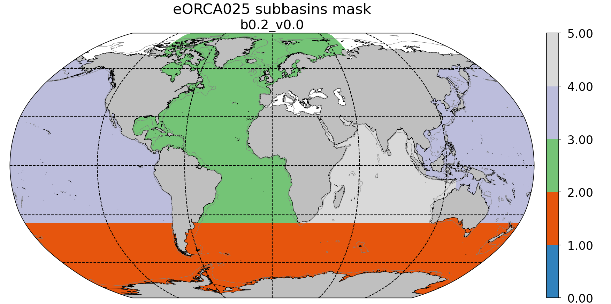

*******************
eORCA025 mask files
*******************

Mesh mask
=========

.. _eORCA025.L121_mesh_mask_b0.2_c3.0_d1.0:

eORCA025.L121_mesh_mask_b0.2_c3.0_d1.0.nc
------------------------------------------

* source:
   - domain cfg: :ref:`eORCA025.L121_domain_cfg_b0.2_c3.0_d1.0`
* comment:
   - build at the same time as the domain cfg file
* tools:
   - r13390 of NEMO DOMAIN_cfg tools
* paths:
   - file: https://ige-meom-opendap.univ-grenoble-alpes.fr/thredds/catalog/meomopendap/extract/eORCA025.L121/eORCA025.L121-MSH/catalog.html?dataset=meomscanpublic/eORCA025.L121/eORCA025.L121-MSH/eORCA025.L121_mesh_mask_b0.2_c3.0_d1.0.nc

Sub bassins
===========

eORCA025_subbassin_b0.2_v0.0.nc
-------------------------------
In order to post process output file, a subbassin file has been built. It contains an atlantic, indian, pacific and southern ocean mask (:numref:`fig_eORCA025_subbasin`).

* core tool:
   - cdfmkmask
* comments:
   - atlmask contains part of the Arctic and not the med
   - somask include under ice shelf seas
   - section defining the basins are hard coded in separate file for eORCA025 (index not lat/lon)
   - compatible with the :ref:`ORCA025_bathymetry_b0.2` file (if coast line change, mask need to be rebuild)
* path:
   - building directory: TOADD
   - file: https://ige-meom-opendap.univ-grenoble-alpes.fr/thredds/catalog/meomopendap/extract/eORCA025.L121/eORCA025.L121-MSH/catalog.html?dataset=meomscanpublic/eORCA025.L121/eORCA025.L121-MSH/eORCA025_subbassin_b0.2_v0.0.nc

.. _fig_eORCA025_subbasin:

  subbasin mask for :ref:eORCA025_subbassin_b0.2_v0.0

isf mask
========

eORCA025_mskisf_b0.2_c3.0_d1.0_v0.0.nc
--------------------------------------
In order to compute easily isf diagnostics (mean, melt ...) a mask with one value per isf has been produced.
The list making the link between the isf id and its name is in eORCA025_mskisf_c3.0_v0.0.txt.
In addition to this, total melt for each ice shelf from Rignot is also added in the txt file.

* tools:
   - cdfisf_fill (./cdfisf_fill -f eORCA025.L121_mesh_mask_b0.2_c3.0_d1.0.nc -v isfdraft -l eORCA025_mskisf_c3.0_v0.0.txt -nc4 -o eORCA025_mskisf_b0.2_c3.0_d1.0.nc -ew -bf eORCA025_isfbnd_c3.0_v0.0.txt)
   - github.com:pmathiot/CDFTOOLS_4.0_ISF.git @ 5b6938c
* compatibility:
   - :ref:`eORCA025.L121_domain_cfg_b0.2_c3.0_d1.0` (each time the bathy or the isf discretisation change, this file need to be rebuild)
* path:
   - building directory: TOADD
   - file: https://ige-meom-opendap.univ-grenoble-alpes.fr/thredds/catalog/meomopendap/extract/eORCA025.L121/eORCA025.L121-MSH/catalog.html?dataset=meomscanpublic/eORCA025.L121/eORCA025.L121-MSH/eORCA025_mskisf_b0.2_c3.0_d1.0_v0.0.nc
