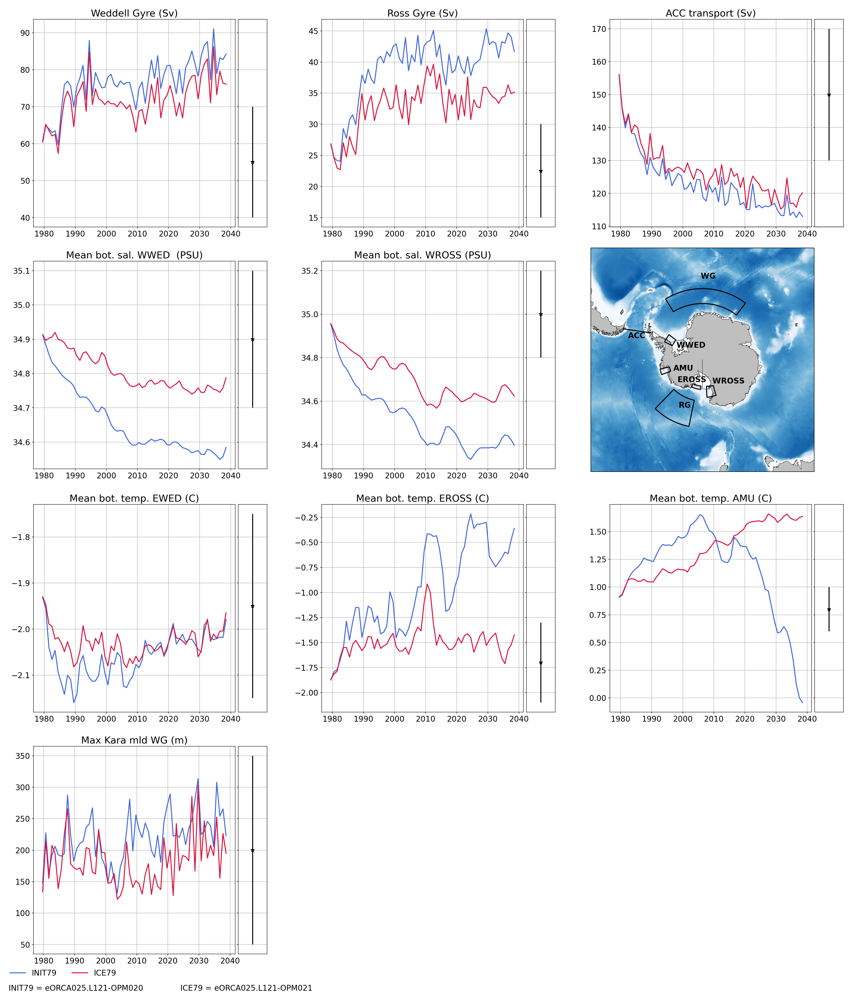

********************
eORCA025.L121-OPM021
********************

Summary
=======

Compare to eORCA025.L121-OPM020, we change the icb distribution (stern et al. 2016) and some sea ice parameters (drag and snow conductivity)
based on Katherine simulation

Namelist
========

Only the change compare to the reference (eORCA025.L121-OPM020) a mentioned here:

namelist_ice
------------

namdyn_rhg
~~~~~~~~~~

* the simulation do not use the aevp rheology, and only iterate 100 times instead of 120 times.

.. code-block:: console

    !------------------------------------------------------------------------------
    &namdyn_rhg     !   Ice rheology
    !------------------------------------------------------------------------------
       ln_rhg_EVP       = .true.          !  EVP rheology
          ln_aEVP       = .false.          !     adaptive rheology (Kimmritz et al. 2016 & 2017)
          rn_creepl     =   2.0e-9        !     creep limit [1/s]
          rn_ecc        =   2.0           !     eccentricity of the elliptical yield curve
          nn_nevp       = 120             !     number of EVP subcycles
          rn_relast     =   0.333         !     ratio of elastic timescale to ice time step: Telast = dt_ice * rn_relast
                                          !        advised value: 1/3 (nn_nevp=100) or 1/9 (nn_nevp=300)
       nn_rhg_chkcvg    =   0             !  check convergence of rheology
                                          !     = 0  no check
                                          !     = 1  check at the main time step (output xml: uice_cvg)
                                          !     = 2  check at both main and rheology time steps (additional output: ice_cvg.nc)
                                          !          this option 2 asks a lot of communications between cpu
    /

namsbc
~~~~~~

* the ice-ocean drag is set to 5e-3 instead of 12e-3

.. code-block:: console

    !------------------------------------------------------------------------------
    &namsbc         !   Ice surface boundary conditions
    !------------------------------------------------------------------------------
       rn_cio           =   5.0e-03       !  ice-ocean drag coefficient (-)
       nn_snwfra        =   2             !  calculate the fraction of ice covered by snow (for zdf and albedo)
                                          !     = 0  fraction = 1 (if snow) or 0 (if no snow)
                                          !     = 1  fraction = 1-exp(-0.2*rhos*hsnw) [MetO formulation]
                                          !     = 2  fraction = hsnw / (hsnw+0.02)    [CICE formulation]
       rn_snwblow       =   0.66          !  mesure of snow blowing into the leads
                                          !     = 1 => no snow blowing, < 1 => some snow blowing
       nn_flxdist       =  -1             !  Redistribute heat flux over ice categories
                                          !     =-1  Do nothing (needs N(cat) fluxes)
                                          !     = 0  Average N(cat) fluxes then apply the average over the N(cat) ice
                                          !     = 1  Average N(cat) fluxes then redistribute over the N(cat) ice using T-ice and albedo sensitivity
                                          !     = 2  Redistribute a single flux over categories
       ln_cndflx        = .false.         !  Use conduction flux as surface boundary conditions (i.e. for Jules coupling)
          ln_cndemulate = .false.         !     emulate conduction flux (if not provided in the inputs)
       nn_qtrice        =   1             !  Solar flux transmitted thru the surface scattering layer:
                                          !     = 0  Grenfell and Maykut 1977 (depends on cloudiness and is 0 when there is snow)
                                          !     = 1  Lebrun 2019 (equals 0.3 anytime with different melting/dry snw conductivities)
    /

namthd_zdf
~~~~~~~~~~

* the snow conductivity is increased from 0.31 to 0.35

.. code-block:: console

    !------------------------------------------------------------------------------
    &namthd_zdf     !   Ice heat diffusion
    !------------------------------------------------------------------------------
       ln_zdf_BL99      = .true.          !  Heat diffusion follows Bitz and Lipscomb 1999
       ln_cndi_U64      = .false.         !  sea ice thermal conductivity: k = k0 + beta.S/T            (Untersteiner, 1964)
       ln_cndi_P07      = .true.          !  sea ice thermal conductivity: k = k0 + beta1.S/T - beta2.T (Pringle et al., 2007)
       rn_cnd_s         =   0.35          !  thermal conductivity of the snow (0.31 W/m/K, Maykut and Untersteiner, 1971)
                                          !     Obs: 0.1-0.5 (Lecomte et al, JAMES 2013)
       rn_kappa_i       =   1.0           !  radiation attenuation coefficient in sea ice                     [1/m]
       rn_kappa_s       =  10.0           !  nn_qtrice = 0: radiation attenuation coefficient in snow         [1/m]
       rn_kappa_smlt    =   7.0           !  nn_qtrice = 1: radiation attenuation coefficient in melting snow [1/m]
       rn_kappa_sdry    =  10.0           !                 radiation attenuation coefficient in dry snow     [1/m]
       ln_zdf_chkcvg    = .false.         !  check convergence of heat diffusion scheme (outputs: tice_cvgerr, tice_cvgstp)
    /

namthd_do
~~~~~~~~~

* the frazil ice parametrization is turned off

.. code-block:: console

    !------------------------------------------------------------------------------
    &namthd_do      !   Ice growth in open water
    !------------------------------------------------------------------------------
       rn_hinew         =   0.1           !  thickness for new ice formation in open water (m), must be larger than rn_himin
       ln_frazil        = .false.          !  Frazil ice parameterization (ice collection as a function of wind)
          rn_maxfraz    =   1.0           !     maximum fraction of frazil ice collecting at the ice base
          rn_vfraz      =   0.417         !     thresold drift speed for frazil ice collecting at the ice bottom (m/s)
          rn_Cfraz      =   5.0           !     squeezing coefficient for frazil ice collecting at the ice bottom
    /

Monitoring
==========

.. _eORCA025.L121-OPM021_monitoring:

Global indicators
-----------------
On these plot you can find a time series of:

- ACC transport
- AMOC at rapid array
- AMHT at rapid array
- Net global heat fluxes
- mean sst in the southern ocean (see box in the map)
- mean sst in the North West Corner (see box in the map)
- sea ice extent (arctic/ant in summer/winter)

.. image:: _static/VALGLO_OPM021.png

Regional indicators
-------------------
On these plot, you can find time series of:

- ACC transport
- Maximum of the Weddell and Ross Gyre (box where the max compute show in the map)
- Mean bottom salinity over the main dense water formation hot spot (West Ross and West FRIS)
- Mean bottom temperature over East Ross and Amudsen sea to monitor CDW intrusion

Local indicators
----------------
These plots monitor the evolution of ice shelf melting and the corresponding shelf properties (ROSS, FRIS, PINE, GETZ)

Amundsen/Belingshausen seas
---------------------------
These plot monitoring the evolution of temperature, salinity and ice shelf melt in Amundsen sea.

Ice shelves
-----------

Amery
~~~~~
.. image:: _static/AMER_OPM021.png

Ross
~~~~
.. image:: _static/ROSS_OPM021.png

Getz
~~~~
.. image:: _static/GETZ_OPM021.png

Pine island
~~~~~~~~~~~
.. image:: _static/PINE_OPM021.png

George VI
~~~~~~~~~
.. image:: _static/GEVI_OPM021.png

Filschner Ronne
~~~~~~~~~~~~~~~
.. image:: _static/FRIS_OPM021.png

Riiser
~~~~~~
.. image:: _static/RIIS_OPM021.png

Fimbul
~~~~~~
.. image:: _static/FIMB_OPM021.png
